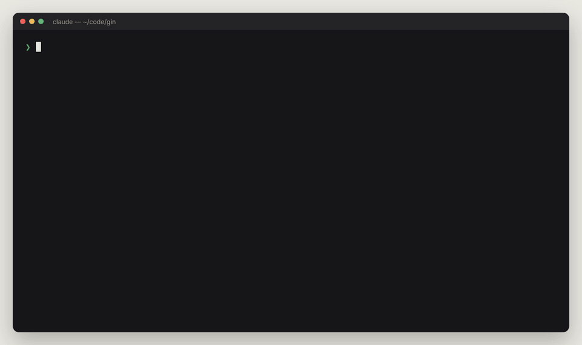
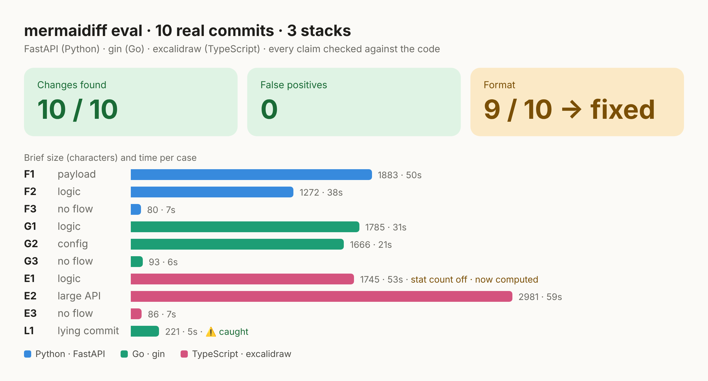

<p align="center"></p>

<h1 align="center">mermaidiff</h1>

<p align="center"><b>git diff for behavior.</b> Type <code>/mermaidiff</code> on a PR or commit and get a sequence diagram of what it changes: ➕ new, ✏️ changed, ➖ removed. Read it in 30 seconds instead of the whole diff.</p>

<p align="center">Works inside Claude Code, Codex and other agents that load skills · GitHub PRs and GitLab MRs · no server, no account</p>

<p align="center"></p>

## Quick start

**Claude Code plugin** (no clone):

```
/plugin marketplace add osmangoninahid/mermaidiff
/plugin install mermaidiff@mermaidiff
```

**Or with the installer** (Claude Code and Codex):

```bash
git clone https://github.com/osmangoninahid/mermaidiff && cd mermaidiff && ./install.sh
```

Then, in any repo, inside your agent (as a plugin the command is `/mermaidiff:mermaidiff`):

```
/mermaidiff                     # your staged or latest change
/mermaidiff <PR or MR link>     # someone else's change
```

The brief opens in your browser. Ask for changes in plain words ("drop the RunTLS step") and the open tab updates. **Copy for MR** gives you markdown that GitHub and GitLab render as is.

## What you get


- **One line** saying what the code changes, taken from the diff, not the commit message
- **A sequence diagram** of only the changed steps, colored like a diff
- **Proof**: up to 5 `file:line` bullets, one short fact each
- **The payload diff** when a request, response, model or config changes
- **⚠️ may break**, only when the code proves a reachable path, and at most 1 open question
- **⚠️ when the commit message or PR text claims something the diff doesn't do**

## The one rule: no false positives

A wrong warning is worse than a missing one. mermaidiff only shows what the diff or the code proves. It never guesses about systems outside your repo, it just lists them as `Not checked`.

## Tested

10 real commits from FastAPI, gin and excalidraw, every claim checked against the code: **10/10 found, 0 false positives**. Briefs in 0.1.5 are 40% shorter than 0.1.4. Details in [eval/](eval/).



## All commands

```
/mermaidiff                     staged, else unstaged, else last commit
/mermaidiff staged
/mermaidiff wip                 unstaged changes
/mermaidiff a1b2c3d             one commit
/mermaidiff main..feature       a range
/mermaidiff <PR link> · #123    GitHub, needs gh
/mermaidiff <MR link> · !123    GitLab, needs glab
/mermaidiff ABC-123             a ticket (experimental, needs a Jira MCP)
/mermaidiff "move sync to a queue"   a plan, no code yet
```

## Install options

Needs `git` and `python3`. Recommended: `rg`, and [CodeGraph](https://github.com/colbymchenry/codegraph) or [Graphify](https://github.com/Graphify-Labs/graphify) for faster caller lookups (falls back to grep).

```bash
./install.sh            # for you: ~/.claude/skills and ~/.agents/skills
./install.sh --project  # for a repo, shared with your team
./install.sh --link     # symlink, if you work on mermaidiff itself
```

The installer downloads Mermaid once for offline use and adds `.mermaidiff/` to your global git ignore. The plugin skips both: the viewer loads Mermaid from a CDN, so add `.mermaidiff/` to your git ignore yourself.

## Status

| | |
|---|---|
| commit, staged, wip, range | tested |
| GitHub PR, GitLab MR | tested |
| browser viewer, live reload, copy for MR | tested |
| ticket mode, Codex | experimental |
| CI job that posts the brief on every PR | planned |
| before / after split view | planned |

## How it works

```
skill/SKILL.md          tells the agent how to gather facts (git, gh, glab, grep or a code graph)
skill/format.md         the output format and the rules, including "no false positives"
skill/scripts/view.py   renders the brief to html, recounts the stat line, opens the browser
eval/                   test cases, expected answers, run prompt, scores
examples/               briefs from public repos
```

## Contributing

Found a wrong claim in a brief? That's the most useful bug report: open an issue with the brief and a link to the commit or PR. See [CONTRIBUTING.md](CONTRIBUTING.md).

## License

MIT. Not affiliated with the [Mermaid](https://mermaid.js.org) project, it just draws with it.
