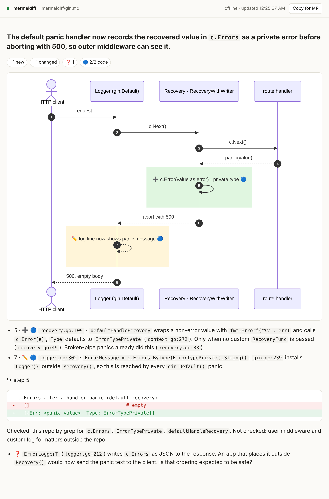

# mermaidiff

**`git diff` for behavior.** Turn any commit, staged change or merge request into a short brief your team can read in 30 seconds: a sequence diagram that shows what is ➕ new, ✏️ changed and ➖ removed, plus the payload diff, proven breaks and open questions.

It runs inside your coding agent (Claude Code, Codex, Cursor) as a skill. No server, no account, nothing leaves your machine except what your agent already sends to its model.



## Why

AI agents write long plans nobody reads. Reviewers read code diffs but not the flow they change. mermaidiff gives one picture that people and agents can both read, adjust and approve.

## The one rule: no false positives

A wrong warning is worse than a missing one. mermaidiff only states what the diff or the code proves:

- every changed step carries an evidence tier: 🟢 verified (seen running) · 🔵 code (in the diff or code) · 🟡 inferred (ticket, plan)
- a break is shown only with the reader that breaks **and** proof the path is reachable
- systems outside the repo are never guessed about, only listed as `Not checked`
- the summary comes from the diff, not the commit message. If the message claims something the diff doesn't do, you get a `⚠️` line

## Results

Tested on 10 real commits from 3 public repos ([eval/](eval/)):

| | FastAPI (Python) | gin (Go) | excalidraw (TS) |
|---|---|---|---|
| changes found | 3/3 | 3/3 + lying commit | 3/3 |
| false positives | 0 | 0 | 0 |

Every non-trivial claim in the briefs was checked against the code. Full scores: [eval/SCORE-2026-10-04.md](eval/SCORE-2026-10-04.md).

## Install

Needs `git` and `python3`. Recommended: `rg`, and [CodeGraph](https://github.com/colbymchenry/codegraph) or [Graphify](https://github.com/Graphify-Labs/graphify) for faster, deeper caller lookups (falls back to grep).

```bash
git clone https://github.com/<you>/mermaidiff && cd mermaidiff
./install.sh            # user-wide: ~/.claude/skills and ~/.agents/skills
./install.sh --project  # inside a repo, shared with the team
./install.sh --link     # symlink, for working on mermaidiff itself
```

The installer downloads Mermaid once for offline use and adds `.mermaidiff/` to your global git ignore.

## Use

```
/mermaidiff                  staged, else unstaged, else last commit
/mermaidiff staged
/mermaidiff wip              unstaged changes
/mermaidiff a1b2c3d          one commit
/mermaidiff main..feature    a range
/mermaidiff <PR link> · #123  GitHub, needs gh
/mermaidiff <MR link> · !123  GitLab, needs glab
/mermaidiff ABC-123          a ticket (experimental, needs a Jira MCP)
/mermaidiff "move sync to a queue"   a plan, no code yet
```

The terminal gets the summary, breaks and questions. The full brief opens in your browser as `.mermaidiff/<mode>.html` and reloads itself when you ask the agent to change it ("drop step 4"). **Copy for MR** puts the markdown on your clipboard: paste it into a GitHub PR or GitLab MR, both render the diagram as is.

More examples: [examples/](examples/)

## Status

| | |
|---|---|
| commit, staged, wip, range, GitLab MR | tested |
| GitHub PR | new, not yet tested |
| browser viewer, live reload, copy for MR | tested |
| ticket mode, Codex | experimental |
| CI job that posts the brief on every MR | planned |
| split view (before / after) | planned |

## Layout

```
skill/SKILL.md          how the agent gathers facts
skill/format.md         the output format and rules
skill/scripts/view.py   renders the brief to html, fixes the stat line, opens the browser
eval/                   cases, expected answers, run prompt, scores
examples/               briefs from public repos
```

## License

MIT. Not affiliated with the [Mermaid](https://mermaid.js.org) project, it just draws with it.
