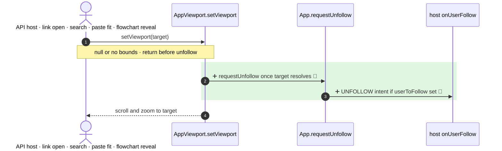

<!-- mermaidiff-key: 8c02bf20d827aacc -->
**`setViewport` now emits an UNFOLLOW intent when it navigates and a collaborator is followed. `setViewport(null)` and unresolved targets don't.**

`+2 new · ❓ 1 · 🔵 2 of 2 backed by code`

- 2 · `App.viewport.ts:707` · `requestUnfollow()` after bounds check
- 3 · `App.tsx:5326` · emits only when `props.userToFollow`

Not checked: host apps handling `onUserFollow` outside the repo.

- ❓ Should in-editor navigation (search match `SearchMenu.tsx:245`, paste fit `App.tsx:4985`, flowchart reveal `App.tsx:5307`) also stop following?
