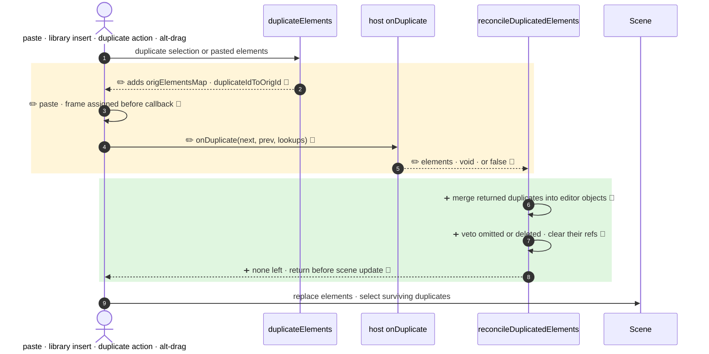

<!-- mermaidiff-key: 0edec332dabf08ce -->
**All three duplication paths now merge `onDuplicate` results into the editor's duplicates, treat omitted, deleted or `false` as a veto, and pass a third lookups argument.**

`+3 new · ~4 changed · 🔵 7 of 7 backed by code`



- 2 · `duplicate.ts:474` · returns `origElementsMap`, `duplicateIdToOrigId`
- 3 · `App.tsx:4880` · frame resolved before `onDuplicate`
- 4, 5 · `types.ts:906` · `data` arg · `false` return allowed
- 6, 7 · `duplicate.ts:543,561,593` · `Object.assign` merge · veto bound text, refs
- 8 · `App.tsx:4908,11270` · `actionDuplicateSelection.tsx:104` · return on no survivors

↳ step 4
```diff
  onDuplicate?: (
    nextElements, prevElements,
+   data: OnDuplicateData,   // 4 read-only maps · always passed
- ) => ExcalidrawElement[] | void
+ ) => ExcalidrawElement[] | void | false
```

Not checked: host apps implementing `onDuplicate` outside the repo.
