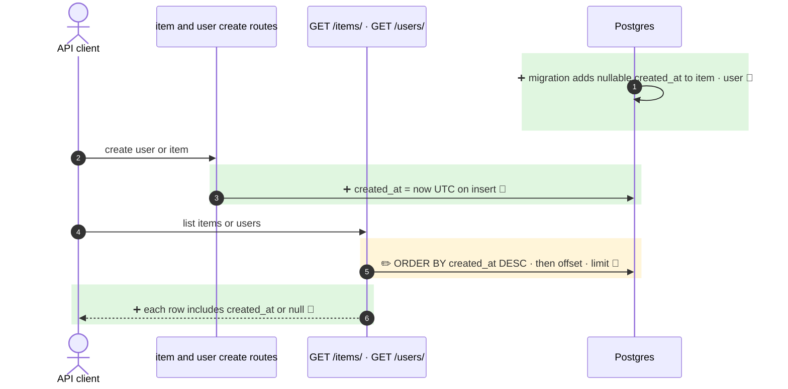

<!-- mermaidiff-key: 4be4e7a0ba1cd97a -->
**`User` and `Item` get a nullable `created_at` column set on create, returned in their public models, and `GET /items/` and `GET /users/` now sort newest first.**

`+3 new · ~1 changed · ❓ 1 · 🔵 4 of 4 backed by code`



- 1 · `fe56fa70289e_add_created_at_to_user_and_item.py:22-23` · nullable DateTime(timezone=True)
- 3, 6 · `models.py:9,52,62,89,103` · `get_datetime_utc` default · public field
- 5 · `items.py:25,38` · `users.py:45` · order by created_at desc

↳ step 6
```diff
  ItemPublic / UserPublic:
    id: uuid                          # required
+   created_at: datetime | None       # optional, default None
```

Not checked: API clients outside the repo.

- ❓ Rows created before the migration keep `created_at` NULL, which Postgres sorts first on DESC. Backfill intended?
