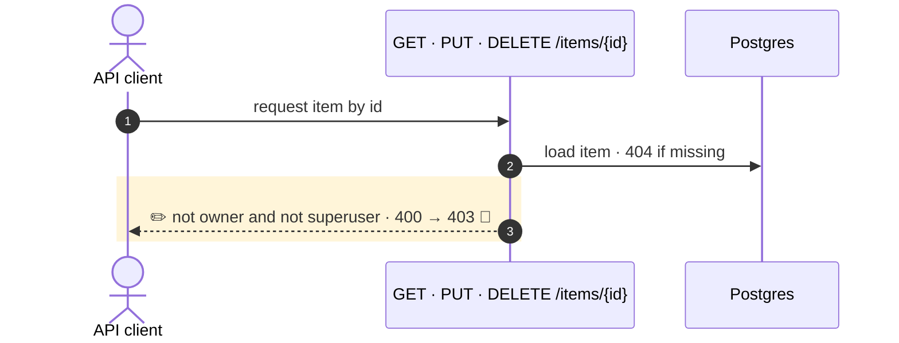

<!-- mermaidiff-key: 0a0be0dde4d5d055 -->
**Item read, update and delete now return 403 instead of 400 when a non-superuser touches an item they don't own. Tests updated to match.**

`~1 changed · ❓ 1 · 🔵 1 of 1 backed by code`



- 3 · `items.py:53,86,106` · status_code 400 → 403

↳ step 3
```diff
  HTTP error response:
-   status: 400
+   status: 403
    detail: "Not enough permissions"     # unchanged
```

Not checked: API clients outside the repo.

- ❓ `main.tsx:22` removes the token and redirects to /login on any 403. Intended for a non-owner item request?
