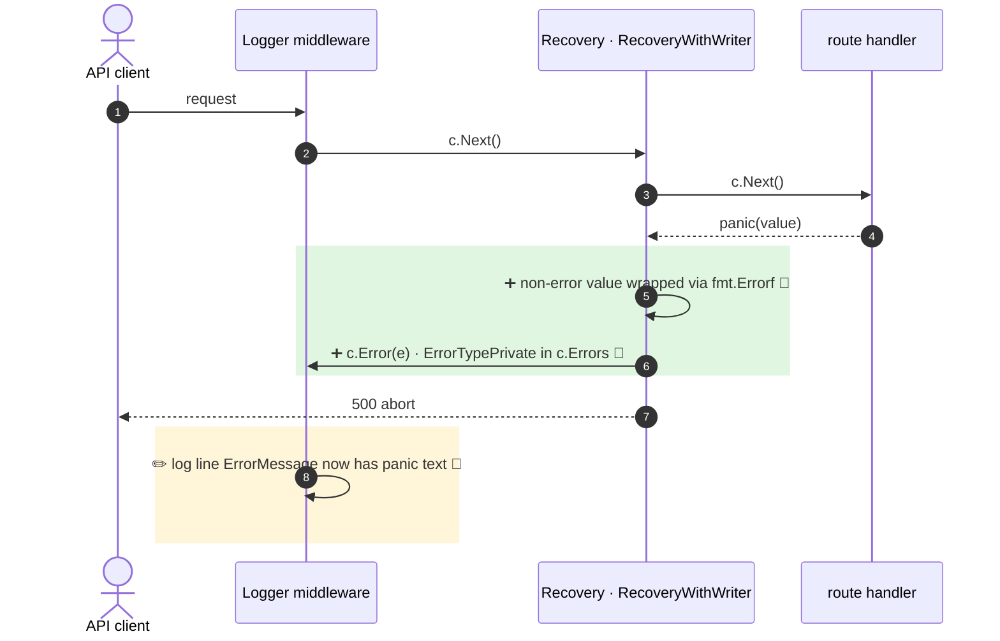

<!-- mermaidiff-key: 818727c2c3ad0855 -->
**Default panic recovery now records the panic value in `c.Errors` as a private error before the 500 abort.**

`+2 new · ~1 changed · 🔵 3 of 3 backed by code`

- 5, 6 · `recovery.go:109-114` · wrap non-error, `c.Error(e)` before abort
- 6 · `context.go:262-277` · plain error stored as `ErrorTypePrivate`
- 8 · `logger.go:302` · `ErrorMessage` from private `c.Errors`

Not checked: custom RecoveryFunc users and API clients outside the repo.
