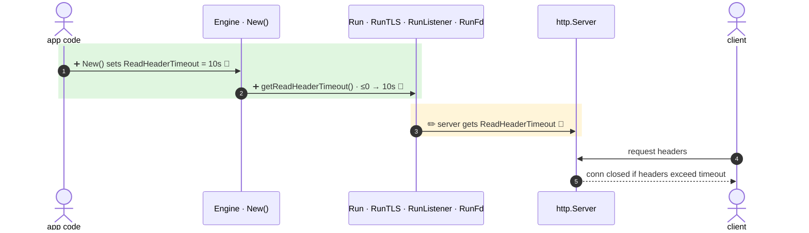

<!-- mermaidiff-key: 17e9edd98abf8eae -->
**New `Engine.ReadHeaderTimeout` field (default 10s) is set on the `http.Server` built by Run, RunTLS and RunListener. Zero or negative falls back to 10s.**

`+2 new · ~1 changed · ❓ 1 · 🔵 3 of 3 backed by code`



- 1 · `gin.go:235` · `ReadHeaderTimeout: defaultReadHeaderTimeout`
- 2 · `gin.go:274-279` · `<= 0` returns 10s default
- 3 · `gin.go:579,600,684` · field set in Run, RunTLS, RunListener · RunFd via `gin.go:651`

↳ step 1
```diff
  type Engine struct {
    MaxMultipartMemory int64
+   ReadHeaderTimeout  time.Duration   // optional, default 10s
    UseH2C             bool
```

Not checked: app servers built outside gin's Run methods.

- ❓ `RunUnix` still builds `http.Server` without the timeout (`gin.go:625`). Left out on purpose?
