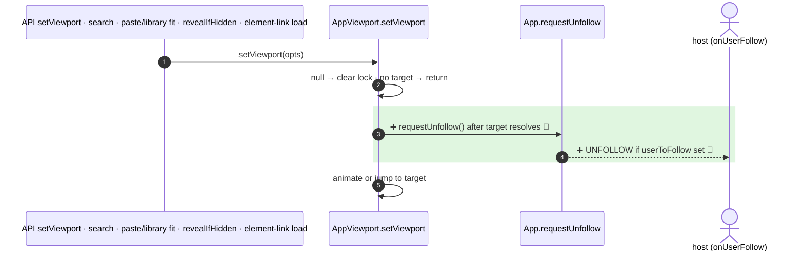

<!-- mermaidiff-key: 8c02bf20d827aacc -->
**`setViewport` now sends an UNFOLLOW intent (`onUserFollow` + emitter) whenever it resolves a target and navigates. `setViewport(null)` and an unresolved target return before that and leave following alone.**

`+2 new · ❓ 1 · 🔵 2 of 2 backed by code`



- 3 · ➕ 🔵 `App.viewport.ts:707` · `this.app.requestUnfollow()` placed after the `if (!bounds) return`
- 4 · ➕ 🔵 `App.tsx:5327` · emits `{ userToFollow, action: "UNFOLLOW" }` only when `props.userToFollow` is set

↳ step 4
```diff
  onUserFollow payload (OnUserFollowedPayload), now also sent from setViewport:
+   { userToFollow: { socketId, username }, action: "UNFOLLOW" }
```

Internal callers that now also unfollow while following: `SearchMenu.tsx:245` (jump to match), `App.tsx:4985` (paste or library insert with `fit`), `App.tsx:5307` (`revealIfHidden`, from flowchart create), `App.tsx:3744` (element link on scene load). In excalidraw-app, `App.tsx:1022` (`onLinkOpen`) goes through it too. Following itself uses `updateScene` + `zoomToFitBounds` (`Collab.tsx:661`), not `setViewport`, so incoming follow updates don't trigger it.

Checked: this repo, git grep for `setViewport`, `requestUnfollow`, `userToFollow` at 02fc9f35, plus the new tests. Not checked: host apps outside the repo that call `setViewport` while following.

- ❓ Should internal auto-navigation (search jump, `revealIfHidden` on flowchart create, paste with `fit`) also break following, or only explicit API calls and link opens?
