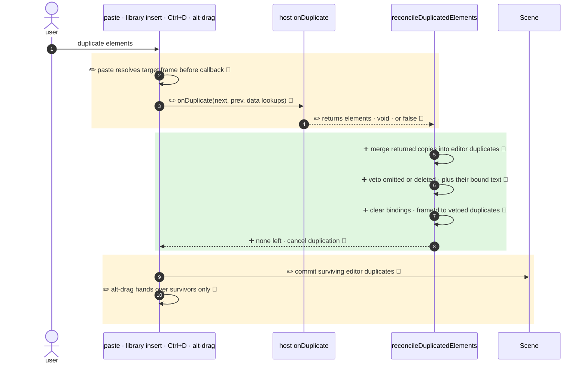

<!-- mermaidiff-key: 0edec332dabf08ce -->
**`onDuplicate` results are now merged into the editor's own duplicates (paste, Ctrl+D, alt-drag). Omitting a duplicate or returning `false` vetoes it, and the callback gets a third `data` argument with lookups.**

`+4 new · ~5 changed · 🔵 9 of 9 backed by code`



- 2 · ✏️ 🔵 `App.tsx:4880` · `getTopLayerFrameAtSceneCoords` + `addElementsToFrame` moved above the callback, so the host sees `frameId` already set
- 3 · ✏️ 🔵 `App.tsx:4897`, `actionDuplicateSelection.tsx:93`, `App.tsx:11259` · third argument `{ duplicateElements, originalElements, origIdToDuplicateId, duplicateIdToOrigId }`. Alt-drag passes the originals reset to their start position (`App.tsx:11248`)
- 4 · ✏️ 🔵 `types.ts:906` · return type is now `ExcalidrawElement[] | void | false`
- 5 · ➕ 🔵 `duplicate.ts:539` · `Object.assign(duplicate, element)`, then `ShapeCache.delete` + `bumpVersion` (`duplicate.ts:547`). Non-duplicate returned elements are used as-is
- 6 · ➕ 🔵 `duplicate.ts:551` · a duplicate not returned or returned with `isDeleted` is dropped. Bound text goes with a vetoed container (`duplicate.ts:559`). `false` drops all of them (`duplicate.ts:517`)
- 7 · ➕ 🔵 `duplicate.ts:589` · `boundElements`, `frameId`, `startBinding`, `endBinding` that point at vetoed duplicates are cleared
- 8 · ➕ 🔵 `App.tsx:4908` paste returns, `actionDuplicateSelection.tsx:104` returns `false`, `App.tsx:11270` alt-drag returns and keeps dragging the originals
- 9 · ✏️ 🔵 `App.tsx:4913` · paste re-runs `syncMovedIndices` after the host, and the frame/bound-text redraw then runs on objects that are actually in the scene (`App.tsx:4916`)
- 10 · ✏️ 🔵 `App.tsx:11277` · `pointerDownState.originalElements` is filled after reconcile, only for surviving duplicates. Originals of vetoed ones stay where they were

↳ step 3
```diff
  onDuplicate?: (
    nextElements: readonly ExcalidrawElement[],
    prevElements: readonly ExcalidrawElement[],
+   data: OnDuplicateData,            // required arg, read-only Maps
- ) => ExcalidrawElement[] | void;
+ ) => ExcalidrawElement[] | void | false;
```

Checked: this repo by grep for `onDuplicate`, `duplicateElements(` and the new lookup fields. Only the three paths above call the callback. `excalidraw-app` doesn't set it. Not checked: host apps outside the repo.
