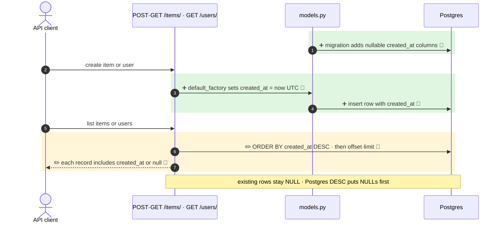

<!-- mermaidiff-key: 4be4e7a0ba1cd97a -->
**`User` and `Item` get a nullable `created_at` (set in Python on insert, no backfill), returned in `UserPublic`/`ItemPublic`. `GET /items/` and `GET /users/` now sort newest first.**

`+3 new · ~2 changed · ❓ 2 · 🔵 5 of 5 backed by code`



- 1 · ➕ 🔵 `fe56fa70289e_add_created_at_to_user_and_item.py:22` · `add_column(..., nullable=True)` on `item` and `user`, no server default, no backfill
- 3 · ➕ 🔵 `models.py:52` · `models.py:89` · `default_factory=get_datetime_utc`, `DateTime(timezone=True)`
- 4 · ➕ 🔵 `models.py:9` · `datetime.now(timezone.utc)` at object creation
- 5 · ✏️ 🔵 `items.py:25` (superuser) · `items.py:38` (owner) · `users.py:45` · `.order_by(<Model>.created_at.desc())` before `offset/limit`
- 6 · ✏️ 🔵 `models.py:62` · `models.py:103` · `created_at: datetime | None = None` on `UserPublic`, `ItemPublic`

↳ step 6
```diff
  ItemPublic / UserPublic:
    id: uuid                       # required
    owner_id: uuid                 # required (ItemPublic only)
+   created_at: datetime | null    # optional · null for pre-migration rows
```

Checked: this repo by grep for `created_at`, `read_items`, `read_users`. No frontend component reads `created_at` yet (only `*.gen.ts`). Not checked: API clients outside the repo.

- ❓ Rows created before this migration keep `created_at = NULL` and, under Postgres `DESC`, list **before** all new rows. Intended, or should the migration backfill / use `NULLS LAST`?
- ❓ Sort has no tiebreaker (e.g. `id`), so pages over equal/NULL `created_at` rows are not stable across `skip` values. Add one?
