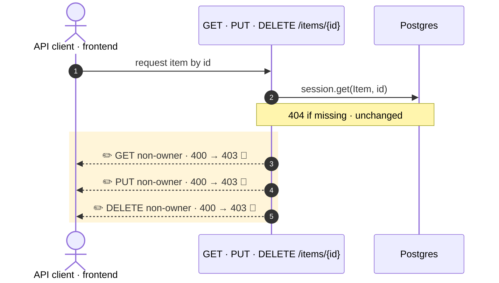

<!-- mermaidiff-key: 0a0be0dde4d5d055 -->
**Item read, update and delete now return `403` instead of `400` when a non-owner, non-superuser asks. The detail text stays the same.**

`~3 changed · ❓ 1 · 🔵 3 of 3 backed by code`



- 3 · ✏️ 🔵 `items.py:53` · `read_item` raises `HTTPException(status_code=403)`
- 4 · ✏️ 🔵 `items.py:86` · `update_item` raises `HTTPException(status_code=403)`
- 5 · ✏️ 🔵 `items.py:106` · `delete_item` raises `HTTPException(status_code=403)`

↳ steps 3–5
```diff
  HTTP response (owner check failed):
-   status: 400 Bad Request
+   status: 403 Forbidden
    body: {"detail": "Not enough permissions"}   # unchanged
```

Checked: this repo by grep for the three handlers, `400`/`403` readers, and frontend `ItemsService` calls. Tests updated in `test_items.py`. Not checked: API clients outside the repo.

- ❓ `main.tsx:22` treats any `403` as a logout and redirects to `/login`. The UI list (`read_items`) shows only the user's own items, so the UI can't reach this today. Should a forbidden item log the user out if it ever does?
