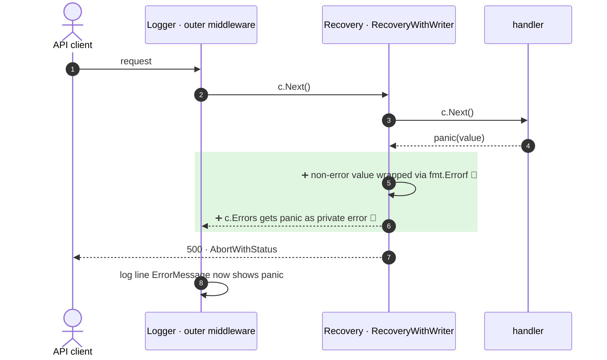

<!-- mermaidiff-key: 818727c2c3ad0855 -->
**The default recovery handler now records the recovered panic in `c.Errors` (as `ErrorTypePrivate`) before aborting with 500.**

⚠️ Message says "bump quic-go to v0.59.1", the diff touches only `recovery.go` and `recovery_test.go`.

`+2 new · ❓ 1 · 🔵 2 of 2 backed by code`



- 5 · ➕ 🔵 `recovery.go:110` · `err.(error)` else `fmt.Errorf("%v", err)`
- 6 · ➕ 🔵 `recovery.go:114` · `c.Error(e)` · `context.go:270` sets `Type: ErrorTypePrivate` unless already `*Error`

↳ step 6
```diff
  c.Errors:   # errorMsgs, read by outer middleware after c.Next()
-   []                                   # panic left no trace
+   - Err: <panic value as error>
+     Type: ErrorTypePrivate
```

Only the default handler changed. Custom `RecoveryFunc` (`CustomRecovery`, `RecoveryWithWriter(out, fn)`) and the broken-pipe branch (`recovery.go:83`, already recorded) behave as before.

Checked: this repo by grep for `defaultHandleRecovery`, `c.Errors` readers (`logger.go:302`, `logger.go:215`), `Default()` order at `gin.go:239`. Not checked: user middleware and log consumers outside the repo.

- ❓ With `ErrorLogger()` mounted outside Recovery, `logger.go:215` now writes the panic text as JSON into the 500 body. Intended?
