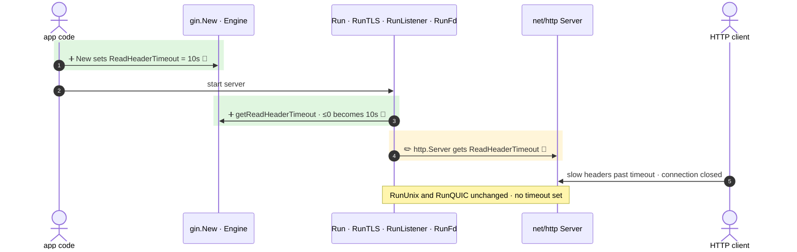

<!-- mermaidiff-key: 17e9edd98abf8eae -->
**`Run`, `RunTLS` and `RunListener` (and `RunFd` through it) now build their `http.Server` with a `ReadHeaderTimeout`, taken from a new `Engine.ReadHeaderTimeout` field. The default is 10s, and a value of zero or less falls back to 10s.**

`+2 new · ~1 changed · ❓ 2 · 🔵 3 of 3 backed by code`



- 1 · ➕ 🔵 `gin.go:235` · `ReadHeaderTimeout: defaultReadHeaderTimeout` in `New()` (const `gin.go:37`, field `gin.go:180`)
- 3 · ➕ 🔵 `gin.go:274` · `if engine.ReadHeaderTimeout <= 0 { return defaultReadHeaderTimeout }`
- 4 · ✏️ 🔵 `gin.go:579`, `gin.go:600`, `gin.go:684` · field added to the server in `Run`, `RunTLS`, `RunListener`. `RunFd` calls `RunListener` at `gin.go:651`

↳ step 1
```diff
  Engine:
    MaxMultipartMemory: int64
+   ReadHeaderTimeout: time.Duration   # optional, default 10s, ≤0 → 10s
    UseH2C: bool
```

Checked: this repo by grep for `getReadHeaderTimeout`, `ReadHeaderTimeout`, `http.Server{` and the `Run*` methods, including the `ginS` wrappers. Not checked: apps that build their own `http.Server`.

- ❓ `RunUnix` (`gin.go:625`) builds an `http.Server` without the timeout. Was it left out on purpose?
- ❓ Setting the field to 0 can't turn the timeout off. The only way out is a custom `http.Server`. Is that intended?
