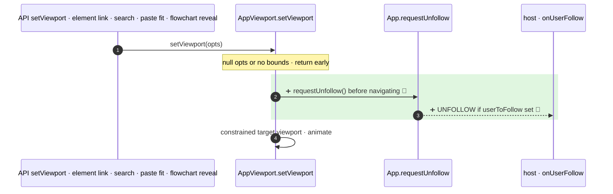

**`setViewport` now emits an `UNFOLLOW` intent (when `userToFollow` is set) every time it actually navigates. `setViewport(null)` and an unresolved target return before it and leave following alone.**

`+1 new · 🔵 1 of 1 backed by code`

- 3 · ➕ 🔵 `App.viewport.ts:707` · `this.app.requestUnfollow()` placed after the `!bounds` return and after the `opts === null` return
- 4 · ➕ 🔵 `App.tsx:5326` · `requestUnfollow` emits `{ userToFollow, action: "UNFOLLOW" }` through `emitUserFollowIntent` (prop `onUserFollow` and the API emitter) only when `props.userToFollow` is set

Internal callers now also unfollow when they navigate: `App.tsx:3744` (element link in URL on load), `App.tsx:4985` (paste or library insert with `fit`), `App.tsx:5307` `revealIfHidden` (flowchart, `App.flowchart.ts:65`, `:175`), `SearchMenu.tsx:245`, and `excalidraw-app/App.tsx:1022` (`onLinkOpen`). The app's own follow path uses `updateScene` + `zoomToFitBounds` (`Collab.tsx:660`), not `setViewport`, so following does not unfollow itself.

Checked: this repo by grep for `setViewport`, `requestUnfollow`, `onUserFollow`, `zoomToFitBounds`. Not checked: host apps outside the repo that call `setViewport` while following.
