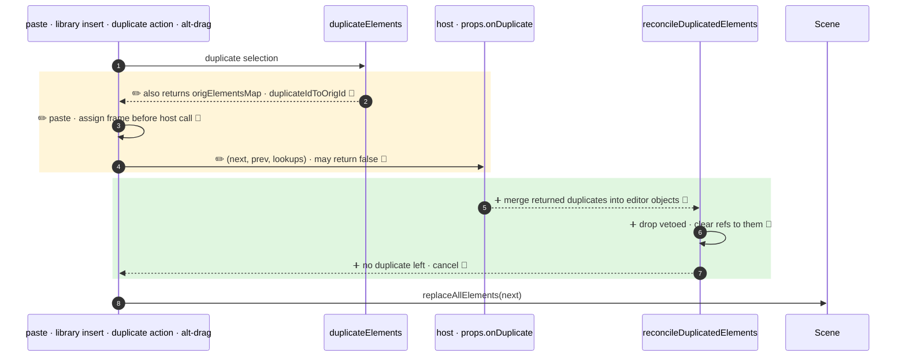

**All three duplication paths (paste / library insert, duplicate action, alt-drag) now pass `onDuplicate` a lookup object and run its result through a new `reconcileDuplicatedElements()`: returned duplicates are merged into the editor's own objects, omitted or deleted duplicates are vetoed, and `false` cancels the duplication. On paste, frame assignment now happens before the host is called.**

`+3 new · ~3 changed · 🔵 6 of 6 backed by code`



- 2 · ✏️ 🔵 `duplicate.ts:474` · result adds `origElementsMap` and `duplicateIdToOrigId` (the old internal map of id → original element is now id → id)
- 3 · ✏️ 🔵 `App.tsx:4880` · paste resolves the top-layer frame and calls `addElementsToFrame` before `onDuplicate`, so the host sees `frameId` already set
- 4 · ✏️ 🔵 `App.tsx:4896`, `actionDuplicateSelection.tsx:92`, `App.tsx:11258` · third arg `OnDuplicateData`, return type adds `false` (`types.ts:906`)
- 5 · ➕ 🔵 `duplicate.ts:543` · returned duplicate is `Object.assign`ed into the editor's duplicate (omitted props kept), then `ShapeCache.delete` + `bumpVersion` (`duplicate.ts:547`). Other returned elements are used as is.
- 6 · ➕ 🔵 `duplicate.ts:561` · bound text of a vetoed container is vetoed too. Survivors lose `boundElements`, `frameId`, `startBinding`/`endBinding` pointing at vetoed ones (`duplicate.ts:605`).
- 7 · ➕ 🔵 `App.tsx:4907` paste returns, `actionDuplicateSelection.tsx:105` returns `false`, `App.tsx:11269` alt-drag keeps dragging the originals. On a partial alt-drag veto, the vetoed originals stay at their start position.

↳ step 4
```diff
  onDuplicate(
    nextElements: readonly ExcalidrawElement[],
    prevElements: readonly ExcalidrawElement[],
+   data: {                                      # always passed
+     duplicateElements, originalElements,       # ReadonlyMap by id
+     origIdToDuplicateId, duplicateIdToOrigId,  # ReadonlyMap id → id
+   },
- ): ExcalidrawElement[] | void
+ ): ExcalidrawElement[] | void | false          # false = cancel
```

Checked: this repo by reading the three call sites, `addElementsToFrame`, and grep for `onDuplicate`. Not checked: host apps that implement `onDuplicate`.
