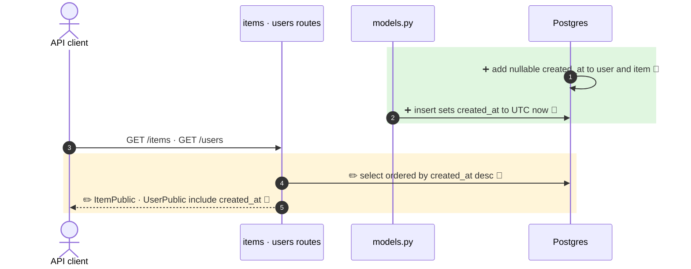

**`User` and `Item` get a nullable `created_at` column (set to UTC now on insert), exposed in `UserPublic` / `ItemPublic`, and the item and user list endpoints now sort newest first.**

`+2 new · ~2 changed · ❓ 1 · 🔵 4 of 4 backed by code`



- 1 · ➕ 🔵 `fe56fa70289e_add_created_at_to_user_and_item.py:22` · `add_column(... DateTime(timezone=True), nullable=True)` on `item` and `user`, no backfill
- 2 · ➕ 🔵 `models.py:52` · `created_at` with `default_factory=get_datetime_utc` on `User` and `Item` (`models.py:89`)
- 4 · ✏️ 🔵 `items.py:25` · `.order_by(Item.created_at.desc())` for superuser and owner queries (`items.py:38`), `users.py:45` same for users
- 5 · ✏️ 🔵 `models.py:62` · `UserPublic.created_at`, `models.py:103` · `ItemPublic.created_at`, mirrored in `types.gen.ts`

↳ step 5
```diff
  ItemPublic:                        # also UserPublic
    id: uuid                         # required
    owner_id: uuid                   # required
+   created_at: datetime | null      # optional, default None
```

Checked: this repo by grep for `created_at`, `order_by`, `ItemPublic`, `UserPublic`. Not checked: API clients outside the repo.

- ❓ Rows that exist before the migration keep `created_at = NULL`. Postgres sorts NULLs first on `DESC`, so old rows list above new ones. Intended, or should the migration backfill?
