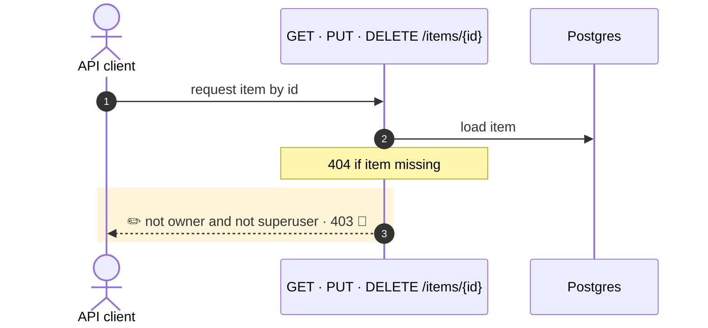

**Item read, update and delete now answer `403` instead of `400` when a non-superuser touches another user's item.**

`~1 changed · ❓ 1 · 🔵 1 of 1 backed by code`



- 3 · ✏️ 🔵 `items.py:53` · `status_code=400` → `403`, same at `items.py:86` (update) and `items.py:106` (delete). Detail text `"Not enough permissions"` unchanged. Tests in `test_items.py` updated to match.

↳ step 3
```diff
  HTTP response (not owner):
-   status: 400
+   status: 403
    detail: "Not enough permissions"
```

Checked: this repo by grep for `Not enough permissions`, `400`, `403`, and item service calls in the frontend. Not checked: API clients outside the repo.

- ❓ `main.tsx:22` clears the token and redirects to `/login` on any 403. The bundled UI only lists a normal user's own items (`items.py:30`, `items.py:35`), so it should not hit this path today. Should a permission 403 on items really log the user out if it ever does?
