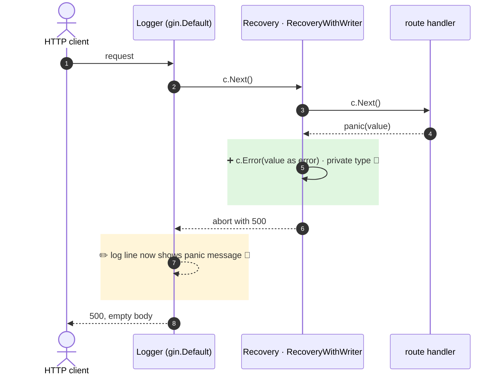

**The default panic handler now records the recovered value in `c.Errors` as a private error before aborting with 500, so outer middleware can see it.**

`+1 new · ~1 changed · ❓ 1 · 🔵 2 of 2 backed by code`



- 5 · ➕ 🔵 `recovery.go:109` · `defaultHandleRecovery` wraps a non-error value with `fmt.Errorf("%v", err)` and calls `c.Error(e)`, `Type` defaults to `ErrorTypePrivate` (`context.go:272`). Only when no custom `RecoveryFunc` is passed (`recovery.go:49`). Broken-pipe panics already did this (`recovery.go:83`).
- 7 · ✏️ 🔵 `logger.go:302` · `ErrorMessage = c.Errors.ByType(ErrorTypePrivate).String()`. `gin.go:239` installs `Logger()` outside `Recovery()`, so this is reached by every `gin.Default()` panic.

↳ step 5
```diff
  c.Errors after a handler panic (default recovery):
-   []                                  # empty
+   [{Err: <panic value>, Type: ErrorTypePrivate}]
```

Checked: this repo by grep for `c.Errors`, `ErrorTypePrivate`, `defaultHandleRecovery`. Not checked: user middleware and custom log formatters outside the repo.

- ❓ `ErrorLoggerT` (`logger.go:212`) writes `c.Errors` as JSON to the response. An app that places it outside `Recovery()` would now send the panic text to the client. Is that ordering expected to be safe?
