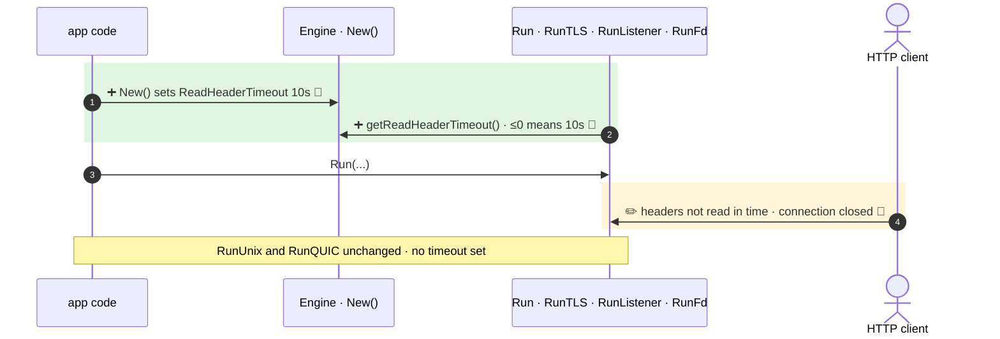

**The `http.Server` built by `Run`, `RunTLS` and `RunListener` (and `RunFd`, which calls it) now has a `ReadHeaderTimeout`, from a new `Engine.ReadHeaderTimeout` field that defaults to 10s.**

`+2 new · ~1 changed · ❓ 1 · 🔵 3 of 3 backed by code`



- 1 · ➕ 🔵 `gin.go:235` · `ReadHeaderTimeout: defaultReadHeaderTimeout` (`gin.go:37`, `10 * time.Second`), new exported field at `gin.go:180`
- 2 · ➕ 🔵 `gin.go:274` · `getReadHeaderTimeout()` returns 10s when the field is zero or negative, so the timeout cannot be turned off through the field
- 4 · ✏️ 🔵 `gin.go:579` · `ReadHeaderTimeout: engine.getReadHeaderTimeout()`, same at `gin.go:600` (TLS) and `gin.go:684` (listener, reached by `RunFd`)

↳ step 1
```diff
  Engine:
    MaxMultipartMemory: int64
+   ReadHeaderTimeout: time.Duration    # optional, default 10s, ≤0 → 10s
    UseH2C: bool
```

Checked: this repo by reading every `Run*` method in `gin.go` and grepping `http.Server{`. Not checked: apps that build their own `http.Server`.

- ❓ `RunUnix` (`gin.go:625`) still builds an `http.Server` without `ReadHeaderTimeout`. Left out on purpose?
